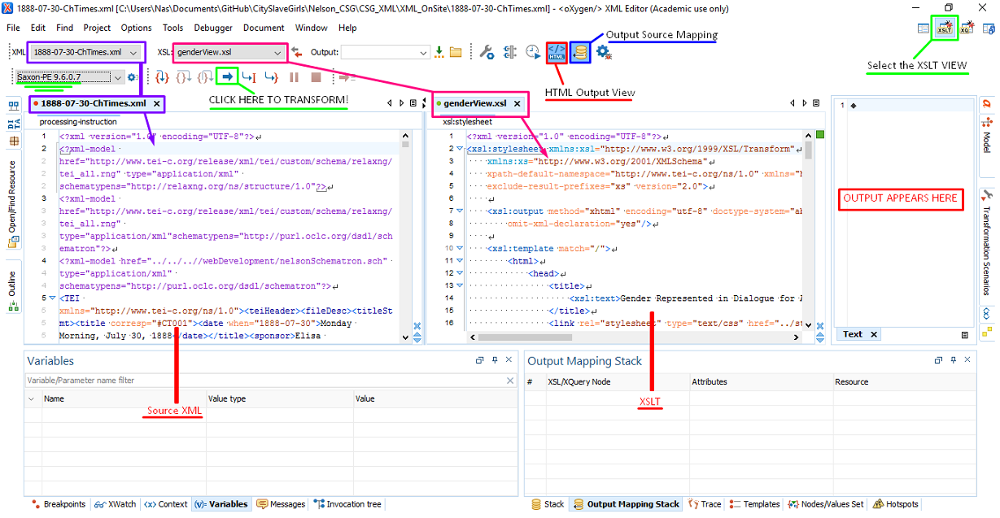

# How to update the site index (si.xml) for the Digital Mitford project

These instructions are meant to guide Digital Mitford team editors through the process of updating our site index working with the [DM_SiteIndex GitHub repo](https://github.com/DigitalMitford/DM_SiteIndex). Note that *only one Mitford editor at a time* may work on this process. Others must stay away from updating SI files in this repo until this process is complete to avoid file conflicts. As you work through these instructions and want to propose changes or ask questions, please post on [this Issue on our repo](https://github.com/DigitalMitford/DM_SiteIndex/issues/7).

## A. Updating your DM_SiteIndex repo and Staging the SI-ADD files
1. Be sure you have up-to-date versions of all files in the `DM_SiteIndex` repo. 
    * Open your git bash shell, navigate to the `DM_SiteIndex` repo (using `cd` to change directories and `ls` to list the contents of a directory). 
    * When you arrive at the directory, type in `git pull` to pull in the up to date versions of all files onto your local computer. 
1. Stage the file(s) containing entries to be added in the Digital Mitford Site Index repo: `DM_SiteIndex` in the `si_Add_Staged` directory. 
1. At this point, you should alert Elisa and/or Lisa Wilson (using the Issues board on the `DM_SiteIndex` repo and pinging them at `@ebeshero` and/or `@lmwilson`) that you are starting work on the Site Index. NOTE: Only one person at a time should be altering site index files in the repo to prevent errors and merge conflicts.

## B. Check the schema lines 
1. Make sure the current SI ODD schema lines are associated with the SI-ADD file(s) so you can check things like the occupation elements for your new entries. These have the filename `si_ODD.rng` at the end of the file path, and always come in pairs (both are necessary for the schema to work). Check schema lines to make sure they are one of the following:

**SI schema lines for SI-ADD files, Version 1:** (published on the website and stable/canonical for SI checking):
  
```
<?xml-model href="https://digitalmitford.org/schemas/out/si_ODD.rng" type="application/xml" schematypens="http://relaxng.org/ns/structure/1.0"?>
<?xml-model href="https://digitalmitford.org/schemas/out/si_ODD.rng" type="application/xml" schematypens="http://purl.oclc.org/dsdl/schematron"?>
```


**SI schema lines for SI-ADD files, Version 2:** local for the GitHub repo and may respond more quickly if you have a slow internet connection:

```
<?xml-model href="../schemas/out/si_ODD.rng" type="application/xml" schematypens="http://relaxng.org/ns/structure/1.0"?>
<?xml-model href="../schemas/out/si_ODD.rng" type="application/xml" schematypens="http://purl.oclc.org/dsdl/schematron"?>
```
## C. Side by Side View in oXygen
Next, open the files you want to work with in oXygen in side-by-side tile view. 
1. Open the file whose entries you wish to add to the SI.
1. Open the **current version of the SI** by using `File > Open URL` in oXygen, and type in: `https://digitalmitford.org/si.xml` to open the current version as published on our website. 
1. Save the published SI file locally inside `DM_SiteIndex/si_Full_IP` as `si-local.xml`. This is the in-progress directory for editing the site index. Always add your edits and new entries to the `si-local.xml` that you save here (and not to the old, outdated `si.xml` in the repo.)  
1. Tile editors next to each other in oXygen by going to `Window > Tile Editors Vertically`.  Now you have prepared your oXygen workspace. Be sure to click in the file in the window you want to use Find or the XPath window and navigate it. 
1. Notice that (for the moment, in summer 2019), the pair of active schema lines of the `si-local.xml` file are *different* from those you are using in the SI-ADD file. This is because the occupation elements in the full site index are mostly not up to our current schema specs. We will fix those in a later stage of the project. For now, in order to catch *meaningful* errors that we can too easily make in the editing process, the schema lines on si-local should be either:
   
    **Web version of `si-local.xml` schema lines:**
```
 <?xml-model href="https://digitalmitford.org/schemas/out/si_ODD_webTmp.rng" type="application/xml" schematypens="http://relaxng.org/ns/structure/1.0"?>
<?xml-model href="https://digitalmitford.org/schemas/out/si_ODD_webTmp.rng" type="application/xml" schematypens="http://purl.oclc.org/dsdl/schematron"?
```
  **Git local directory version of `si-local.xml` schema lines**
```
<?xml-model href="../schemas/out/si_ODD_localTestTmp.rng" type="application/xml" schematypens="http://relaxng.org/ns/structure/1.0"?>
<?xml-model href="../schemas/out/si_ODD_localTestTmp.rng" type="application/xml" schematypens="http://purl.oclc.org/dsdl/schematron"?> 
```  

## D. Editing the si-local.xml file
You will have two different kinds of SI alterations to make:

a. edits to existing entries

b. entirely new entries to add

It may not always be clear which of these are you are working with. Always search the full SI carefully to be sure with a proposed “new” entry is really new. Here are some search tips:
* Search for a person by checking for the first few letters of the surname as an xml:id value. For example, if the surname is Dagwood, try searching with: **="Dag** *without* a closing quotation mark: This brings up any `@xml:ids` beginning with the string, "Dag".
* Try just `Dag` in the Find window
* Try an XPath in the Window, on `//surname[contains(., 'Dag')]`
* Try searching for parts of names or parts of titles, etc.

## E. Keep your place, and push your work in small stages

Updating the site index needs to be careful, precise work, and can easily be interrupted. Make sure you are positioning new entries in the appropriate list. For example, Mitford team members *must not* be filed in historical persons, bibls *must not* be filed with fictional people, etc.  

Delete each entry from the SI-ADD file as you are inserting it into the `si-local.xml` file. This is equivalent to crossing it off as added. 

Place new entries at the top of a list to be sure you are putting them in the right list, and to be able to see what you recently added. 

Every few entries, push your work to GitHub. Remember the three-part sequence:
1. git add .
1. git commit -a -m "added more entries to si"
1. git push

When you finish adding all the entries in the SI-ADD file you were working with, delete it, and push that change up to the repo. You don't need it any more because your entries are now all incorporated in `si-local.xml`.

## F. IMPORTANT: Update `catalogue.xml` in `si_Add_Staged` directory as files change

As you remove files and add new ones to si_Add_Staged directory, be sure you change the file names listed in the `catalogue.xml` file in that directory! If we forget to do this, the Digital Mitford project schema won't know how to search for staged `xml:ids` and the project schema fires mysterious errors for our editing team. 

## G. De-duping (dealing with duplicate entries)

In the process of editing the site index, you may locate duplicate entries there. When that happens: 
1. Record the duplicate `@xml:id`s, and the duplicate entry names/titles/etc in the current SI file. 
2. [Write an Issue](https://github.com/DigitalMitford/DM_SiteIndex/issues) on the `DM_SiteIndex` web repo pinging `@ebeshero` about these, indicating the conflicting `@xml:id`s . She will check to see which of these are being referenced in project files and help resolve which is the best for us to keep. Wait for her response before finalizing the newly edited version of the SI. (You can keep going in revising and adding new entries, but leave a note for yourself to go back and resolve the issue with the duplicate entries entries.)
3. When ready to resolve the duplicate entries, carefully(!) review their code. Each entry may contain valuable information that is absent in the other entry. Be sure to preserve the distinct information from each entry before eliminating an entry in the `si-local.xml` file. 

## H. Finalizing the updated Site Index: from `si-local.xml` to `si.xml` with AlphaSort.xsl

When you have completed a stage of work and want to generate a new issue of the site index, it's time to wrap up your work. Here is an overview of what needs to be done (details follow):
1. Save `si-local.xml` in the `si_Full_Staged` directory (if you haven't been saving it there already).  
1. Click the checkmark to refresh validation on `si-local.xml` and watch the errors. (Be sure that the `si-local.xml` file has the distinct schema lines that ignore occupation code so you can see serious errors.) Correct all serious errors revealed by validation. Push your changes to GitHub.
1. Visit TEI header on the `si-local.xml` file to update the `<revisionDesc>` (last big element in the TEI header) to add an explanation of your work to the change log there. Push your changes to GitHub.
1. Run `AlphaSort.xsl` (from the `xslt` directory) to alphabetically sort the newly added entries and set a new count of all entries. Output the results of this XSLT as `si.xml` and save in the same `si_Full_Staged` directory. NOTE: If the XSLT transformation does not succeed it will be because the `si-local.xml` file is not well-formed XML due to errors introduced in the editing process that have gone unseen. (Sometimes this happens because the site index file is very lengthy and schema validation takes a long time to catch problems.) XSLT will catch such problems instantly, because it cannot run over XML that is not well formed.  

To run XSLT, you need to change to the XSLT view in oXygen, by finding and clicking on the XSLT debugger button in the top right corner. What you need to set is marked in the graphic below:



* In the graphic, we've selected the Saxon PE parser, but I'd recommend Saxon EE for this. 
* You need to select the correct XML filename you wish to process in the `XML:` box (it doesn't matter which XML file's code appears visible on the screen).* You need to select the correct XSLT filename you wish to run the transformation in the `XSL:` box.
* In the `Output` box, *be very careful* to select the correct location for the output file: Click the folder next to it to browse to the GitHub directory where you want to save the `si.xml` file: this is the same directory where `si-local.xml` is right now, the `si_Full_Staged` directory in the `DM_SiteIndex` git directory on your computer. Type in `si.xml` as the filename you wish to save. If there's an older version of the `si.xml` file in place there, your transformation will overwrite it, and that's what we want to do.
* Click the big blue button in the middle to transform the file. 
* The output window doesn't check whether the output is valid, so actually go and open the newly saved `si.xml` in oXygen, and wait for it to validate to be sure it is behaving the same way that the `si-local.xml` file did. 

## I. Wrapping up: GitHub tasks to conclude the process
1. **Add**, **commit**, and **push** your work up to this point to GitHub.
1. Ping @ebeshero by [opening an Issue](https://github.com/DigitalMitford/DM_SiteIndex/issues) on the `DM_SiteIndex` web repo to let Elisa know the Site Index is ready for posting and processing through the Digital Mitford ODD project schema. 
1. Delete the (by now empty) `SI-ADD` file you were working with if you didn’t do so already. 
1. Update `catalogue.xml` in the `si_Add_Staged` directory to reflect the current listing of SI-ADD files staged in this repo. This ensures that the Digital Mitford project schema can read those files and function properly for the editing team. 
1. Lastly, **add**, **commit**, and **push** these last changes to GitHub to clean up and thoroughly update the `DM_SiteIndex` repo.

Congratulations! Take a moment to celebrate that you’ve updated the Digital Mitford Site Index! You have made the semantic web a better place today! :-)


